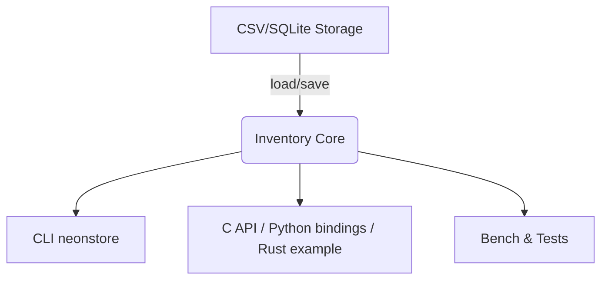

# Architecture (Mermaid)

```mermaid
flowchart TD
  A[CSV/SQLite Storage] -->|load/save| B(Inventory Core)
  B --> C[CLI neonstore]
  B --> D[C API / Python bindings / Rust example]
  B --> E[Bench & Tests]
```
